# osTicket Ticket Lifecycle Examples

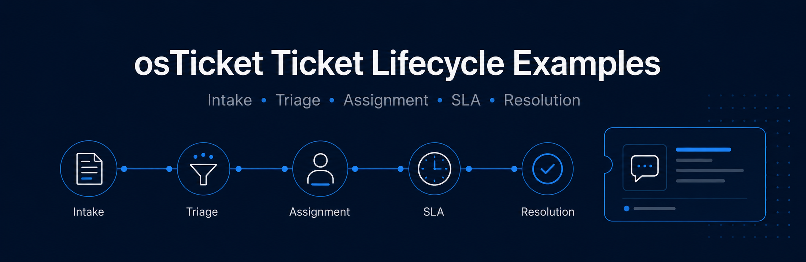

## Project Summary

This project demonstrates ticket lifecycle examples within the osTicket help desk system. After completing the osTicket installation and post-installation configuration labs, I created support tickets as end users, reviewed and updated ticket properties as help desk agents, assigned tickets to the correct departments, applied SLA plans, and worked tickets through completion.

The purpose of this project was to gain hands-on experience with ticket intake, ticket triage, priority assignment, department routing, SLA management, agent permissions, and ticket resolution workflows in a help desk environment.

## Related osTicket Projects

- [osTicket: Prerequisites and Installation](https://github.com/CameronJohnson-IT/osticket-prereqs)
- [osTicket: Post-Installation Configuration](https://github.com/CameronJohnson-IT/post-install-config)
- [osTicket: Ticket Lifecycle Examples](https://github.com/CameronJohnson-IT/ticket-lifecycle)

## Technologies Used

- osTicket
- Microsoft Azure
- Azure Virtual Machines
- Remote Desktop Protocol
- Internet Information Services (IIS)
- PHP
- MySQL
- Web-based ticketing system

## Languages / Components Used

- PHP
- SQL / MySQL
- osTicket web application
- IIS web server components
- Web-based admin and agent interfaces

## Environments Used

- Microsoft Azure
- Windows 10 Virtual Machine
- osTicket Admin Panel
- osTicket Agent Panel
- osTicket End-User Portal

## Project Objectives

- Create support tickets as end users
- Observe ticket properties as help desk agents
- Configure ticket priority, department, SLA, and assignment
- Route tickets to the correct departments
- Work tickets through completion
- Understand ticket visibility and access permissions
- Practice real-world help desk ticket handling
- Explain how ticket intake works in a technical support environment

## Implementation Steps

### Step 1: Access the osTicket Admin/Agent Panel

Logged into the osTicket Admin/Agent panel using the agent accounts created during the post-installation configuration lab.

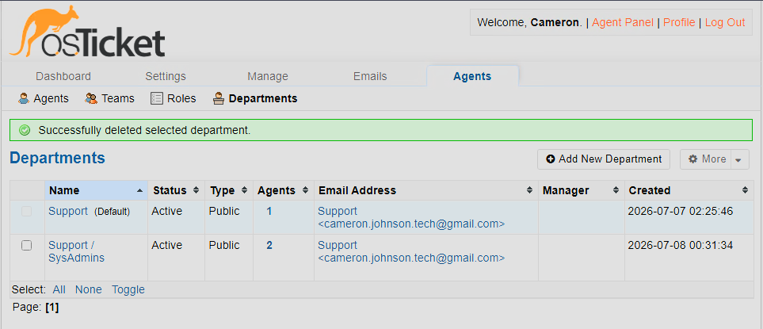

### Step 2: Access the osTicket End-User Portal

Accessed the osTicket end-user portal to create support tickets from the customer side of the help desk system.

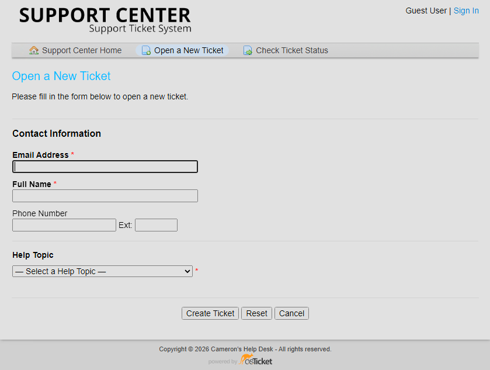

### Step 3: Prepare Departments for Ticket Routing

Updated the department structure before working ticket examples. The `SysAdmins` department was changed to a top-level department, and the `Maintenance` department was deleted instead of archived.


### Step 4: Create Ticket 1 - Mobile Banking System Down

Created a ticket as an end user with the issue:

```text
entire mobile/online banking system is down
```

This ticket represents a high-impact service outage that would require urgent attention.

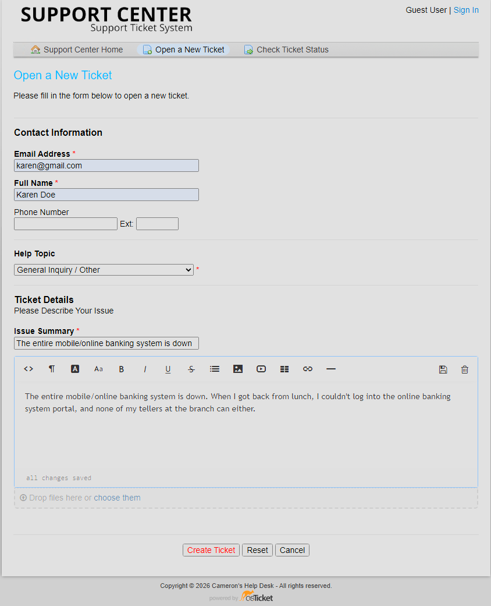

### Step 5: Observe Ticket 1 as John

Logged in as the help desk agent `John` and observed the ticket properties, including priority, department, SLA, and assignment.

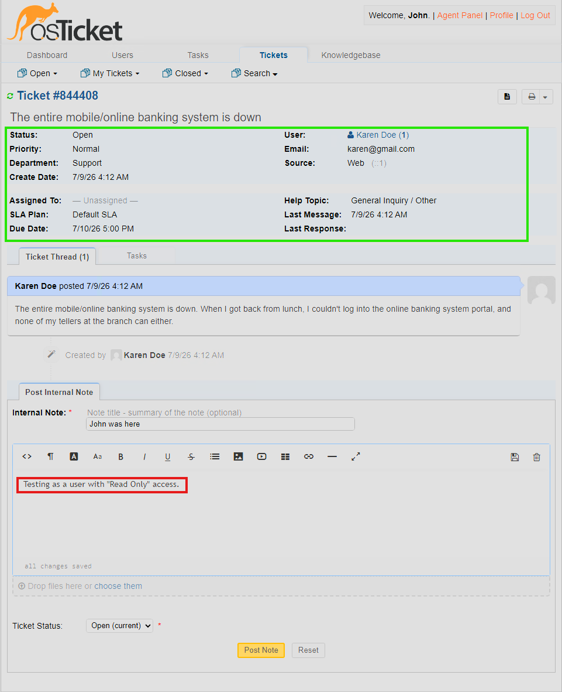

### Step 6: Set Ticket 1 Properties

Updated the ticket properties for the mobile banking outage.

Configured properties:

- Priority: Emergency
- SLA: Sev-A, 1 hour, 24/7
- Department: Support / SysAdmins
- Help Topic: Business Critical Outage
- Assigned To: `Jane Doe`

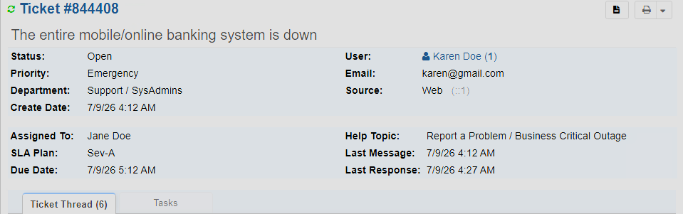

### Step 7: Test Ticket 1 Visibility

Attempted to observe the ticket again as `John` after it was assigned to the Support / SysAdmins department. This demonstrated how department routing and permissions can affect ticket visibility.

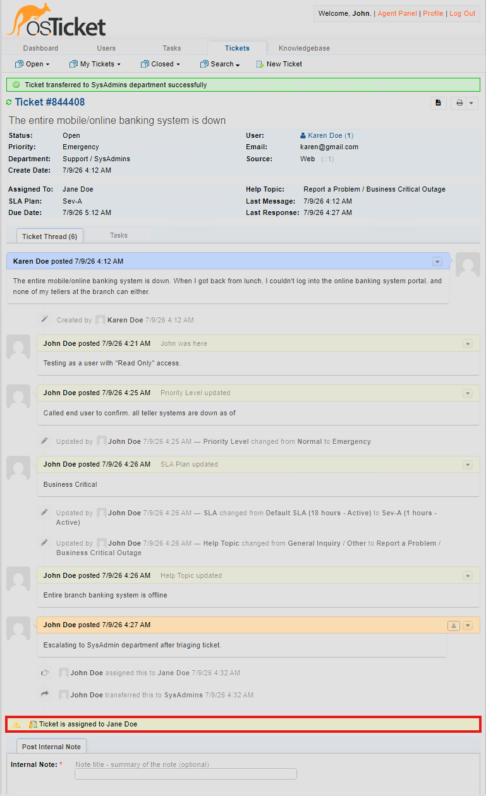

### Step 8: Work Ticket 1 to Completion as Jane

Logged in as `Jane` and worked the mobile banking outage ticket through completion.

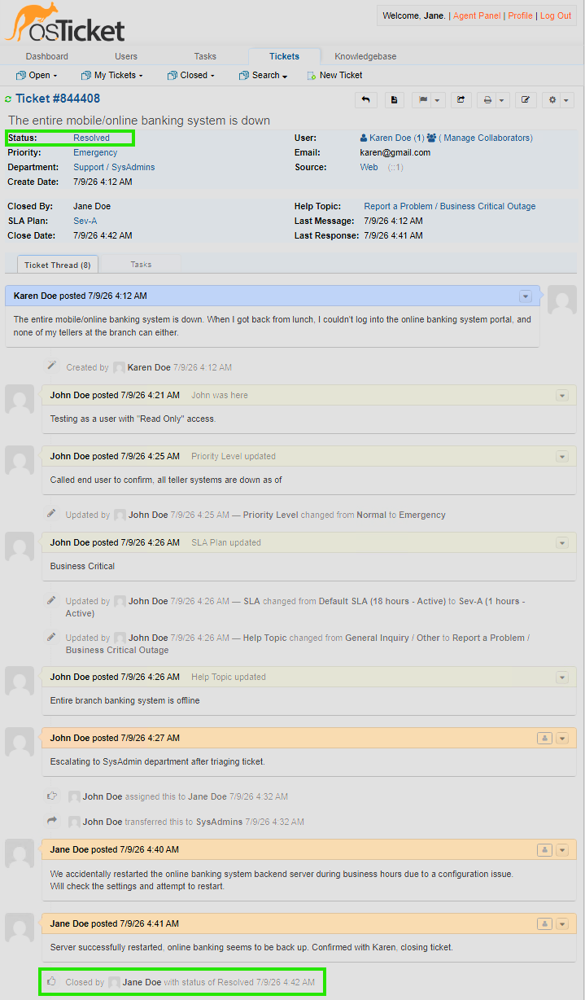

### Step 9: Create Ticket 2 - Adobe Upgrade Issue

Created a second ticket as an end user with the issue:

```text
accounting department needs adobe upgrade, broken
```

This ticket represents a software/application support issue affecting a business department.

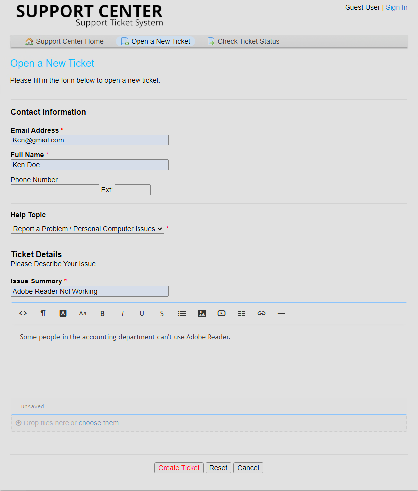

### Step 10: Observe Ticket 2 as John

Logged in as `John` and observed the ticket properties for the Adobe upgrade issue, including priority, department, SLA, and assignment.

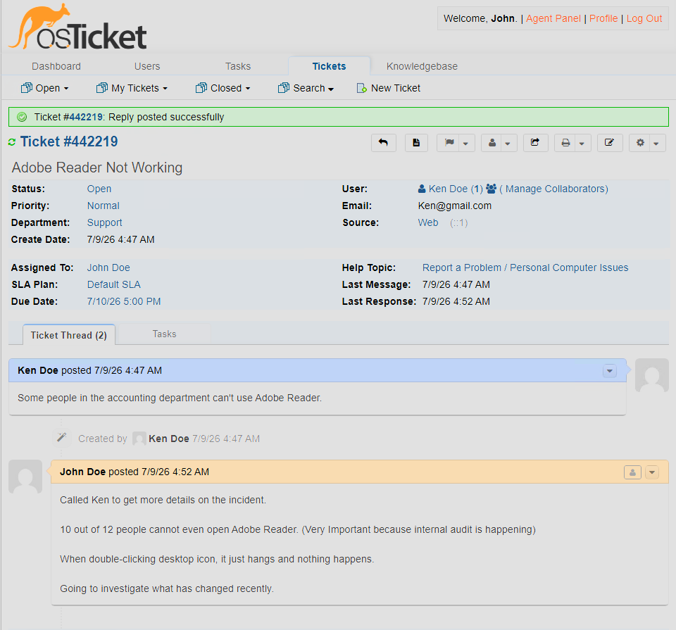

### Step 11: Set Ticket 2 Properties

Updated the ticket properties for the Adobe upgrade issue.

Configured properties:

- Priority: High
- SLA: Sev-B, 4 hours, 24/7
- Department: Support
- Help Topic: Personal Computer Issues
- Assigned To: `John Doe`

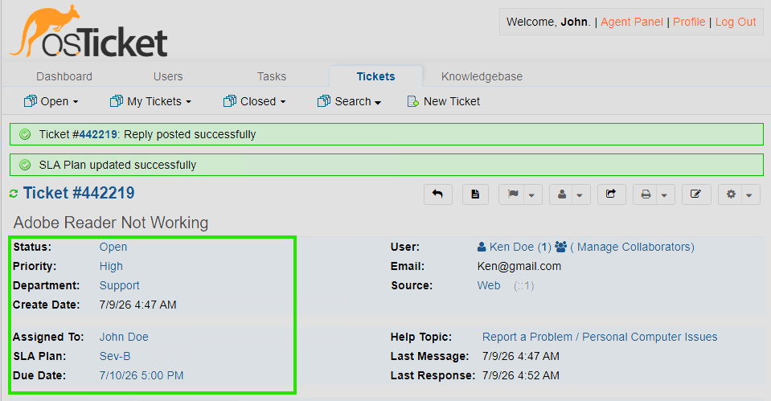

### Step 12: Work Ticket 2 to Completion as John

Worked the Adobe upgrade ticket through completion as `John`.

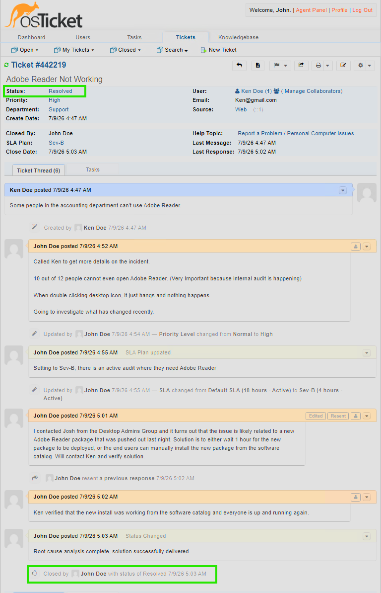

### Step 13: Create Ticket 3 - Marketing Laptop Display Issue

Created a third ticket as an end user with the issue:

```text
Sarah's comptuer keeps freezing and flickering
```

This ticket represents a hardware or endpoint support issue affecting a business user.

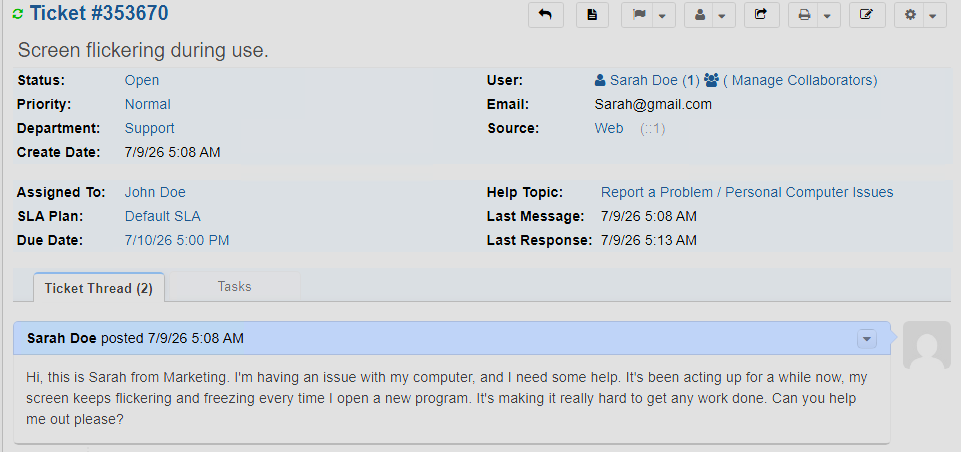

### Step 14: Observe Ticket 3 as John

Logged in as `John` and observed the ticket properties for the CFO laptop issue, including priority, department, SLA, and assignment.

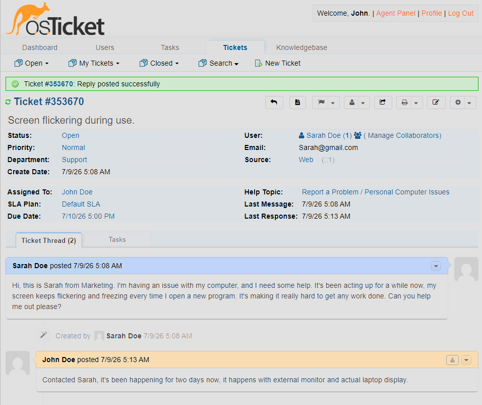

### Step 15: Set Ticket 3 Properties

Updated the ticket properties for the CFO laptop issue.

Configured properties:

- Priority: High
- SLA: Sev-B, 4 hours, 24/7
- Department: Support
- Help Topic: Personal Computer Issues
- Assigned To: `John Doe`

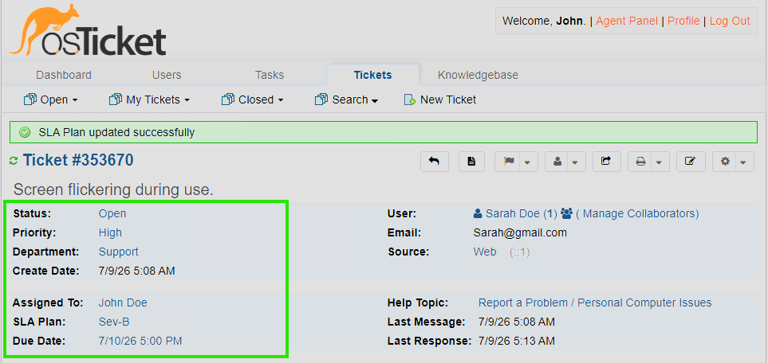

### Step 16: Work Ticket 3 to Completion as John

Worked the CFO laptop ticket through completion as `John`.

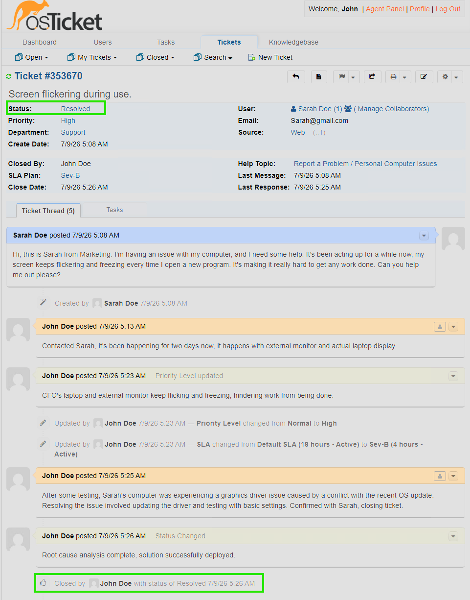


## Demonstration

This project demonstrates how tickets move through a help desk system from creation to resolution. Tickets were created through the end-user portal, reviewed from the agent side, assigned ticket properties, routed to the correct departments, and worked through completion.

The lab also demonstrated how departments, agent permissions, SLA plans, and ticket assignments affect visibility and responsibility inside osTicket.

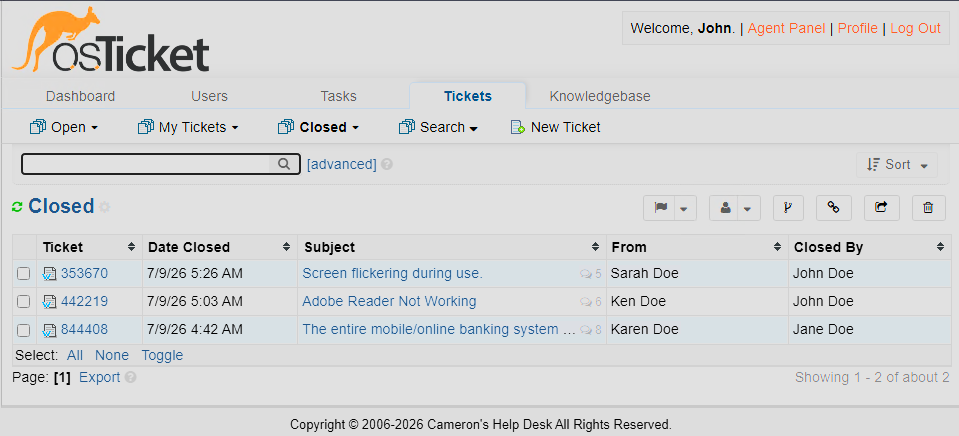

## Ticket Intake Explanation

In real help desk environments, tickets can be created through several intake channels, including email, phone, chat, web forms, or direct interaction with a user. Even when an issue is fixed immediately, creating a ticket is still important because it documents the work performed, tracks recurring problems, helps measure support workload, and creates a record for future troubleshooting.

Ticketing systems help support teams organize requests, prioritize urgent issues, assign work to the right people, and maintain accountability throughout the support process.

## Skills Demonstrated

- Help desk ticket intake
- Ticket triage and prioritization
- SLA assignment
- Department routing
- Agent ticket management
- Ticket visibility and permission testing
- End-user support workflow
- Ticket resolution documentation
- Help desk operations
- Technical documentation

## Key Takeaways

This project helped me understand the full lifecycle of a support ticket, from user submission to agent review, triage, routing, escalation, and resolution. I learned how ticket properties such as priority, department, SLA, and assignment affect how work is handled inside a help desk system.

It also reinforced the importance of documenting support work in a ticketing system, even when an issue is resolved quickly. Tickets provide visibility, accountability, metrics, and a reliable history of technical support activity.
